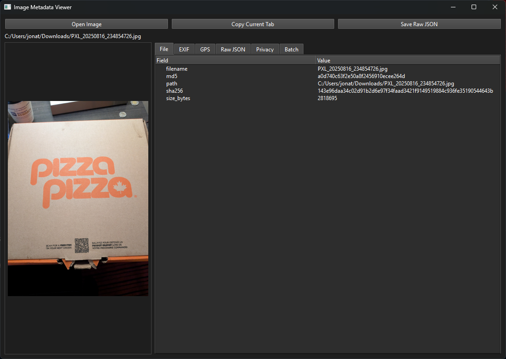
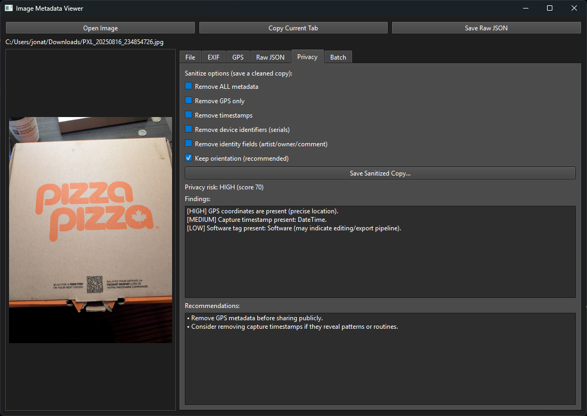
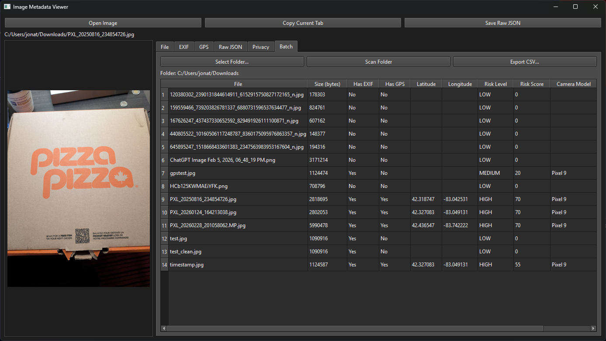
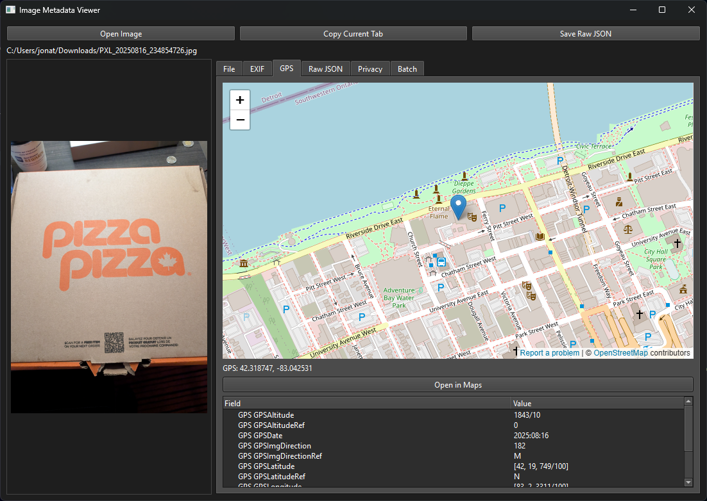

# 📷 Image Metadata Privacy Toolkit

[](https://www.python.org/downloads/)
[](LICENSE)
[](#)

A professional-grade desktop application for analyzing, auditing, and sanitizing image metadata (EXIF/GPS) with built-in privacy risk scoring, batch scanning, and embedded map visualization.

**Built with:** Python + PySide6 (Qt)

## Table of Contents

- [Overview](#overview)
- [Features](#features)
- [Installation](#installation)
- [Usage](#usage)
- [Supported Formats](#supported-formats)
- [Privacy & Security](#privacy--security)
- [License](#license)

## Overview

Most online EXIF viewers require uploading images to third-party services, creating privacy and security risks. Image Metadata Privacy Toolkit runs entirely **offline** on your machine, allowing you to inspect and remove sensitive metadata without exposing personal files.

**Designed for:**

- Privacy auditing & verification
- Digital forensics exploration
- Security & awareness training
- Bulk metadata triage
- Metadata sanitization before public sharing

## Features

### 📑 Single Image Analysis

- Extract EXIF using dual parsing engines (Pillow + exifread)
- View structured metadata in tree view format
- Display file integrity hashes (MD5 & SHA-256)
- Drag & drop image loading
- Embedded image preview panel

### 🌍 GPS Intelligence

- Convert EXIF GPS coordinates (DMS) to decimal format
- Embedded OpenStreetMap view with auto-zoom
- One-click "Open in Maps" functionality
- Clear indicators for GPS presence/absence

### 🛡️ Privacy Risk Scanner

Automatically analyzes metadata and assigns:

- **Risk Level:** LOW / MEDIUM / HIGH
- **Risk Score** with detailed breakdown
- **Flagged findings:**
  - GPS coordinates & location data
  - Device serial numbers
  - Identity fields
  - Capture timestamps
  - Editing software tags
- Recommended mitigation steps

### ✂️ Selective Metadata Removal

Create sanitized copies with granular control:

- Remove GPS coordinates only
- Remove timestamps only
- Remove device identifiers
- Remove identity fields
- Remove all metadata (optionally preserve orientation)
- JPEG/TIFF surgical EXIF editing (via piexif)
- Safe container re-save for other formats

### 📂 Batch Folder Scanner

Scan entire directories efficiently:

- Detect EXIF presence across images
- Identify GPS-tagged files
- Extract decimal coordinates
- Compute privacy risk levels
- Identify camera models
- Sortable table view with multiple columns
- CSV export for reporting
- Click row to preview image

## Screenshots

### Metadata Viewer


### Privacy Risk Analysis


### Batch Folder Scanner


### GPS Map View


## Installation

### Prerequisites

- Python 3.8 or higher
- pip (Python package manager)
- ~500MB disk space for dependencies

### Option 1: From Source (Development)

```bash
# Clone the repository
git clone https://github.com/Jon1689/image-metadata-viewer.git
cd image-metadata-viewer

# Create virtual environment
python -m venv .venv

# Activate virtual environment
# Windows:
.venv\Scripts\activate
# macOS/Linux:
source .venv/bin/activate

# Install dependencies
pip install -r requirements.txt

# Run application
python src/main.py
```

### Option 2: Standalone Executable (Recommended)

Download the latest release from [Releases](../../releases) page.
No Python installation required.

## Dependencies

| Package | Purpose |
|---------|---------|
| `PySide6` | Qt GUI framework |
| `Pillow` | Image processing |
| `exifread` | EXIF data reading |
| `piexif` | EXIF data editing |
| `Qt WebEngine` | Embedded browser for maps |

Run `pip install -r requirements.txt` to install all dependencies.


## Usage

### Basic Workflow

1. **Open an image** via drag & drop or file browser
2. **Review metadata** in the structured tree view
3. **Check privacy risk** with the built-in scanner
4. **Remove sensitive data** as needed and export sanitized copy

### Batch Operations

1. Select a folder to scan
2. Review results in the table view
3. Export CSV report or remove metadata in bulk

## Supported Formats

| Format | Read | Edit |
|--------|------|------|
| JPEG/JPG | ✅ | ✅ |
| PNG | ✅ | ⚠️ |
| TIFF | ✅ | ✅ |
| BMP | ✅ | ❌ |
| WebP | ✅ | ❌ |
| HEIC | ✅ | ❌ |

*Note: EXIF editing support is best with JPEG and TIFF formats.*

## Design Philosophy

This tool was built with core principles in mind:

- **Offline First** — No data leaves your machine
- **Transparency** — Raw JSON always available for inspection
- **Selective Control** — Remove only the metadata you choose
- **Security Awareness** — Highlight privacy risks, not just display data
- **Professional Workflow** — Branch-based development with pull requests

## Privacy & Security

### Important Notes

- The embedded map feature requires an internet connection to load OpenStreetMap tiles
- **No image files are uploading** — only coordinates are transmitted to render maps
- All metadata processing occurs locally on your machine
- Sanitized copies are created separately; original files remain unchanged

### Use Cases

- 🖼️ Preparing photos for social media
- 🔍 Auditing phone camera roll for location leakage
- 🔬 Forensic triage of collected media
- 📚 Security awareness training
- 🎓 Cybersecurity coursework demonstrations


## Roadmap

Planned features and improvements:

- [ ] Risk heatmap visualization
- [ ] Diff viewer for before/after metadata comparison
- [ ] Recursive folder scanning optimization
- [ ] Automated anomaly detection
- [ ] GitHub Actions CI/CD pipeline
- [ ] Metadata backup & recovery features

## Contributing

Contributions are welcome! Please feel free to submit issues and pull requests.

1. Fork the repository
2. Create a feature branch (`git checkout -b feature/amazing-feature`)
3. Commit your changes (`git commit -m 'Add amazing feature'`)
4. Push to the branch (`git push origin feature/amazing-feature`)
5. Open a Pull Request

## License

This project is licensed under the MIT License — see the [LICENSE](LICENSE) file for details.

## Author

**Jon1689** 
- GitHub: [@Jon1689](https://github.com/Jon1689)

## Support

If you encounter issues or have suggestions, please open an [issue](../../issues) on GitHub.

---

Made with ❤️ for privacy and security awareness.
